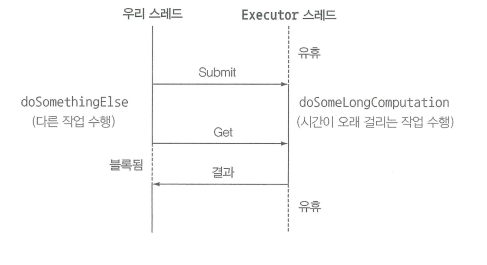
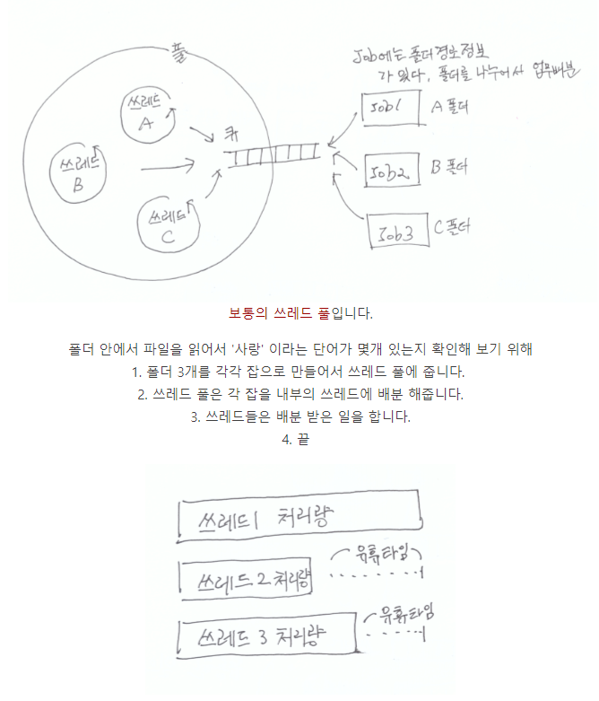
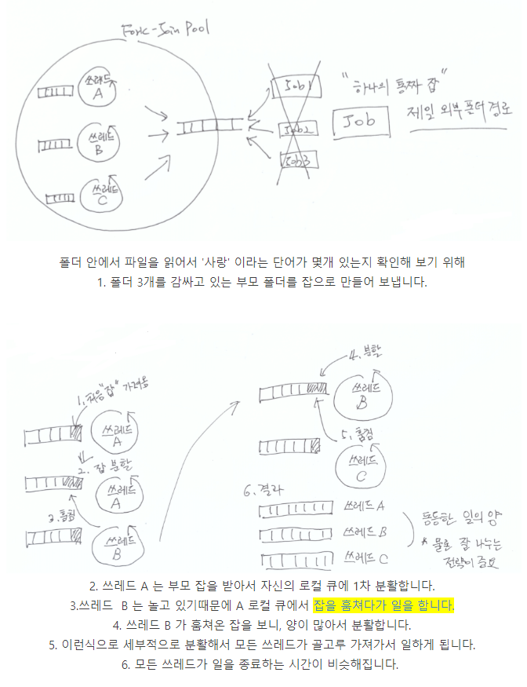
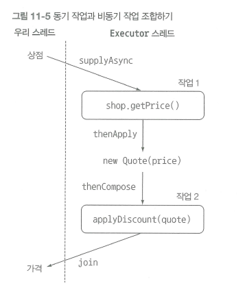
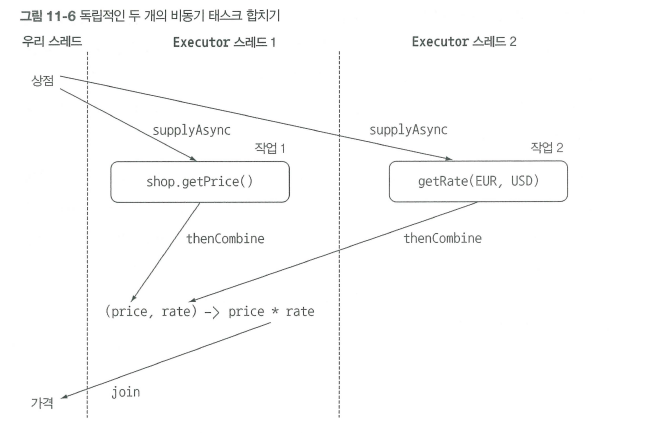

# CompletableFuture

[TOC]

## Future

* 비동기 계산을 위해 java5부터 추가

* ```java
  ExecutorService executor = Executors.newCachedThreadPool();
  Future<Double> furture = executor.submit(new Callable<Double>(){
      public Double call() {
          return doSomeLongComputation(); //시간이 오래 걸리는 작업
      }
  });
  
  if (!furture.isDone()) {
      doSomethingElse();
      try {
          Double result = furture.get(1, TimeUnit.SECONDS);
      } catch (InterruptedException e) {
          // 현재 스레드에서 대기 중 인터럽트 발생
      } catch (ExecutionException e) {
          // 계산 중 예외 발생
      } catch (TimeoutException e) {
          e.printStackTrace();    //Future가 완료되기 전에 타임아웃 발생
      }
      //...
  } else {
      furture.get();
     
      //...
  }
  ```

* Executors.newCachedThreadPool() : 스레드 풀 생성. 초기 스레드 수와 코어 스레드 수는 0개이고, 스레드 개수보다 작업 개수가 많으면 새 스레드를 생성시켜 작업을 처리

  * 1개 이상의 스레드가 추가되었을 경우 60초 동안 추가된 스레드가 아무 작업을 하지 않으면 추가된 스레드를 종료하고 풀에서 제거

* Executors.newFixedThreadPool(int nThreads)  :  생성된 스레드 풀의 초기 스레드 개수는 0개이고, 코어 스레드 수는 nThreads, 최대 스레드 개수도 nThreads

  * 스레드가 작업을 처리하지 않고 놀고 있더라도 스레드 개수가 줄지 않음

* isDone() : 비동기 계산이 완료되었는지 확인

* isCancelled(): 비동기 계산이 취소되었는지 확인

* get() : 작업이 완료될 때까지 blocking, 완료되면 결과값 리턴

  * 

* 간결한 동시 실행 코드 구현하기가 어려움

  * 여러 Future 결과가 있을 때 의존성 표현하기 어렵
  * ex) 오래 걸리는 A 라는 작업이 끝나면 그 결과를 다른 오래 걸리는 계산 B로 전달, 그리고 B의 결과가 나오면 다른 질의의 결과와 B의 결과를 조합하시오


## 비동기 API 구현

* 가격정보 반환 하는 메서드

  * ```java
    public double getPrice (String product) {
      	return calculatePrice(product)
    }

    private double calculatePrice (String product) {
      	delay()	// Thread.sleep(1000L)
      	return new Random().nextDouble() * product.charAt(0) + product.charAt(1);
    }
    ```

  * getPrice() 호출시 1초간 블록


* 동기 메서드를 비동기 메서드로 변환

  * ```java
     public Future<Double> getPriceAsync(String product){
            CompletableFuture<Double> futurePrice = new CompletableFuture<>();
            new Thread(() ->{
                try {
                  	//다른 스레드에서 비동기적으로 계산 수행
                    double price = calculatePrice(product);
                    futurePrice.complete(price);
                } catch(Exception e) {
                    futurePrice.completeExceptionally(e);
                }
            }).start();
     		//계산 결과를 기다리지 않고 Future 반환
            return futurePrice;
     }
     ```
  * **completeExceptionally : CompletableFuture 내부에서 발생한 예외를 클라이언트에 전달**
  * ```java
    Shop shop = new Shop("Best Shop");
    long start = System.nanoTime();
    Future<Double> futurePrice = shop.getPriveAsync("my favorite product");
    long invocationTime = ((System.nanoTime() - start) / 1_100_100);
    System.out.println("Invocation returned after " + invocationTime + "msc");
    
    shop.doSomethingElse();
    
    try {
      double price = futurePrice.get();
      System.out.printf("price is %.2f%n", price);
    } catch (Exception e) {
      throw new RuntimeException(e);
    }
    
    long retrievalTime = ((System.nanoTime() - start) / 1_1000_100);
    System.out.println("Price returned after " + retrievalTime + "msc");
    ```


* 팩토리 메서드 supplyAsync로 CompletableFuture 만들기

  * ```java
    public Future<Double> getPrice(String product) {
            return CompletableFuture.supplyAsync(() -> calculatePrice(product));
            }
    ```

  * supplyAsync 메서드는 Supplier(매개 변수 없고 리턴값을 가지고 있는 인터페이스)를 인수로 받아서 CompletableFuture를 반환. 

  * CompletableFuture는 Supplier를 실행해서 비동기적으로 결과를 생성한다. 

  * ForkJoinPool의 Executor 중 하나가 Supplier를 실행

  * 

  * 

  * ForkJoinPool은 프로세서 수(Runtime.getRuntime().availableProcessors())에 상응하는 스레드를 가짐

  * 두 번째 인수를 받는 오버로드 버전의 supplyAsync 메서드를 이용해서 다른 Executor를 지정할 수 있다. 


##  비블록 코드 만들기

* 상점 리스트

  * ```java
    private List<Shop> shopList
            = Arrays.asList(new Shop("BestPrice"),
                            new Shop("LetsSaveBig"),
                            new Shop("MyFavoriteShop"),
                            new Shop("BuyItAll"));
    ```

* 모든 상점에 순차적으로 가격 정보 요청
  * ```java
    public List<String> findPrices(String product) {
            return shopList.stream()
                    .map(shop -> String.format("%s price is %.2f", shop.getShopNm(), shop.getPrice(product)))
                    .collect(toList());
    }
    ```

  * ```java
    long start = System.nanoTime();
    System.out.println(findPrices("myPhone27S"));
    long duration = ((System.nanoTime() - start) / 1_100_100);
    System.out.println("Done in " + duration + "msc");
    ```

    네개의 상점에서 가격을 검색하는 동안 1초의 대기시간이 있으므로 약 4초보다 조금더 걸린다.


* 병렬 스트림으로 요청 받기

  * ```java
    public List<String> findPricesParallelStream(String product) {
            return shopList.parallelStream()
                    .map(shop -> String.format("%s price is %.2f", shop.getShopNm(), shop.getPrice(product)))
                    .collect(toList());
    }
    ```

  * 병렬 스트림은 내부적으로 ForkJoinPool 사용

* CompletableFuture로 비동기 호출 구현

  * ```java
    public List<String> findPricesCompletableFuture(String product) {
            List<CompletableFuture<String>> priceFutures = shopList.stream()
                    .map(shop -> CompletableFuture.supplyAsync(() -> shop.getShopNm() + " price is " + shop.getPrice(product)))
                    .collect(toList());
        
            return priceFutures.stream().map(CompletableFuture::join)
                    .collect(toList());
    }
    ```

  * join() : Future 인터페이스의 get 메서드와 같은 의미, CompletableFuture 결과값 반환

  * 하나의 파이프 라인으로 연산을 처리 했다면 모든 가격 정보 요청 동작이 동기적, 순차적으로 처리된다.

  * 

* 커스텀 Executor 사용하기

  * ```java
     private final Executor executor = Executors.newFixedThreadPool(Math.min(shopList.size(), 100), new ThreadFactory() {
         @Override
         public Thread newThread(Runnable r) {
             Thread t = new Thread(r);
             t.setDaemon(true);
             return t;
         }
     });
     
     public List<String> findPricesCompletableFuture(String product) {
             List<CompletableFuture<String>> priceFutures = shopList.stream()
                     .map(shop -> CompletableFuture.supplyAsync(() -> shop.getShopNm() + " price is " + shop.getPrice(product), executor))
                     .collect(toList());
         
             return priceFutures.stream().map(CompletableFuture::join)
                     .collect(toList());
     }
     ```


## 비동기 작업 파이프라인 만들기

* ```java
  public class Discount {
      public enum Code {
          NONE(0), SILVER(5), GOLD(10), PLATINUM(15), DIAMONE(20);
  
          private final int percentage;
  
          Code(int percentage) {
              this.percentage = percentage;
          }
      }
      //...
  }
  ```

* ```java
  public String getPrice(String product) {
          double price = calculatePrice(product);
                  Discount.Code code = Discount.Code.values()[new Random().nextInt(Discount.Code.values().length)];
          return String.format("%s:%.2f:%s", shopNm, price, code);
      }
  
  public double calculatePrice(String product) {
      Common.delay();
      return new Random().nextDouble() * product.charAt(0) + product.charAt(1);
  }
  ```
* `BestPrice:123.26:GOLD`


* 할인 서비스 구현

  * ```java
    public class Quote {
        private final String shopNm;
        private final double price;
        private final Discount.Code discountCode;

        public Quote(String shopNm, double price, Discount.Code discountCode) {
            this.shopNm = shopNm;
            this.price = price;
            this.discountCode = discountCode;
        }
        
        public static Quote parse (String s) {
            String[] split = s.split(":");
            String shopNm = split[0];
            double price = Double.parseDouble(split[1]);
            Discount.Code discountCode = Discount.Code.valueOf(split[2]);
            return new Quote(shopNm, price, discountCode);
        }

        public String getShopNm() {
            return shopNm;
        }

        public double getPrice() {
            return price;
        }

        public Discount.Code getDiscountCode() {
            return discountCode;
        }
    }
    ```

  * ```java
    public class Discount {
        public enum Code {
            NONE(0), SILVER(5), GOLD(10), PLATINUM(15), DIAMOND(20);

            private final int percentage;

            Code(int percentage) {
                this.percentage = percentage;
            }
        }

        public static String applyDiscount(Quote quote) {
            return quote.getShopNm() + " price is " + Discount.apply(quote.getPrice(), quote.getDiscountCode());
        }

        public static double apply(double price, Code code) {
            delay();
            return (price * (100 - code.percentage) / 100);
        }
    }
    ```

* 할인 서비스 사용

  * ````java
       public List<String> findPrices(String product) {
            return shopList.stream()
                    .map(shop -> shop.getPrice(product))
                    .map(Quote::parse)
                    .map(Discount::applyDiscount)
                    .collect(Collectors.toList());
        }
       ````


* 동기 작업과 비동기 작업 조합하기

  * ```java
    public List<String> findPricesStream(String product) {
        List<CompletableFuture<String>> pricefutres= shopList.stream()
                .map(shop -> CompletableFuture.supplyAsync(() -> shop.getPrice(product), executor))
                .map(future -> future.thenApply(Quote::parse))
                .map(future -> future.thenCompose(quote -> CompletableFuture.supplyAsync(() -> Discount.applyDiscount(quote), executor)))
                .collect(Collectors.toList());
        
        return pricefutres.stream()
            .map(CompletableFuture::join)
            .collect(Collectors.toList());    
    }
    ```

  * 

  * 가격 정보 얻기

  * Quote 파싱하기

    * thenApply() : A의 결과를 받아, 다른 결과를 내보는 Function 과 같은 역할을 수행, CompletableFuture가 끝날 때까지 블록하지 않는다.

  * completableFuture를 조합해서 할인된 가격 계산하기

    * thenCompose() : A(completableFuture)로부터의 최종 결과가 끝나는 즉시, B를 실행. 두 비동기 연산을 파이프라인으로 만들수 있다.


* 독립 CompletableFuture와 비독립 CompletableFuture 합치기

  * ```java
    Future<Double> futurePriceInUSD = 
                CompletableFuture.supplyAsync(() -> shop.getPrice(product))
                .thenCombine(CompletableFuture.supplyAsync(() -> exchangeService.getRate(ExchangeService.Money.EUR, ExchangeService.Money.USD)),
                             (price, rate) -> price * rate);
    ```

  * thenCombine() : 파라미터로 또 다른 CompleteableFuture 를 받으며, 동시에 각 비동기 작업의 결과로 다른 결과를 도출하는 BiFunction 을 받아 두 CompleteableFuture 조합함

  * 

  * ```java
    ExecutorService executor = Executors.newCachedThreadPool();
            final Future<Double> futureRate = executor.submit(
                new Callable<Double>() {
                    @Override
                    public Double call() throws Exception {
                        return ExchangeService.getRate(ExchangeService.Money.EUR, ExchangeService.Money.USD);
                    }
                }
            );
    
            final Future<Double> futurePriceInUSD = executor.submit(
                new Callable<Double>() {
                    @Override
                    public Double call() throws Exception {
                        double priceInEUR = shop.getPrice(product);
                        return priceInEUR * futureRate.get();
                    }
                }
            );
            
    return futurePriceInUSD;
    ```


##  CompletableFuture의 종료에 대응하는 방법

* 각 상점마다 다른 지연 시간을 주기 위해 임의의 지연을 흉내내는 메서드 추가함

  * ```java
    public static void randomDelay() {
            int delay = 500 + new Random().nextInt(2000);
            try {
                Thread.sleep(delay);
            } catch (InterruptedException e) {
                throw new RuntimeException(e);
            }
        }
    ```

* 최저가격 검색 애플리케이션 리팩토링

  * 모든 가격 정보를 표함할때까지 리스트 생성을 기다리지 않도록 고쳐야함

  * ```java
    public Stream<CompletableFuture<String>> findPricesStream(String product) {
            return shopList.stream()
                .map(shop -> CompletableFuture.supplyAsync(() -> shop.getPrice(product), executor))
                .map(future -> future.thenApply(Quote::parse))
                .map(future -> future.thenCompose(quote -> CompletableFuture.supplyAsync(() -> Discount.applyDiscount(quote), executor)));
        }
    ```

  * ```java
    CompletableFuture[] futures = findPricesStream("myPhone27S")
                .map(f -> f.thenAccept(s -> System.out.println()))
                .toArray(size -> new CompletableFuture[size]);
            CompletableFuture.allOf(futures).join();
    ```

  * thenAccept() : thenApply()와 동일 하고 반환 값을 갖지 않음 .

  * allOf :  CompletableFuture[]의 모든 작업의 실행 완료를 기다린 후 CompletableFuture[] 반환

  * allAny: CompletableFuture[]에서 처음으로 완료된 CompletableFuture<OBject>를 반환


------

참고

<http://www.hanbit.co.kr/store/books/look.php?p_code=B1999551123>

<https://hamait.tistory.com/612>